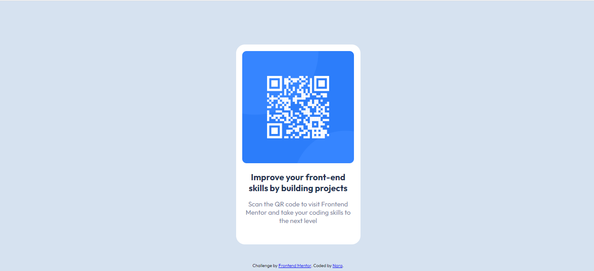

# Frontend Mentor - QR code component solution

This is a solution to the [QR code component challenge on Frontend Mentor](https://www.frontendmentor.io/challenges/qr-code-component-iux_sIO_H). Frontend Mentor challenges help you improve your coding skills by building realistic projects. 

## Table of contents

- [Overview](#overview)
  - [Screenshot](#screenshot)
  - [Links](#links)
- [My process](#my-process)
  - [Built with](#built-with)
  - [What I learned](#what-i-learned)
  - [Continued development](#continued-development)
- [Author](#author)

## Overview

### Screenshot



### Links

- Solution URL: [Solution by Thaynara (Tnara or Nara)](https://github.com/Tnaraa/Tnara.github.io)
- Live Site URL: [solution website](https://tnaraa.github.io/Tnara.github.io/)

## My process

### Built with

- Semantic HTML5 markup
- CSS custom properties
- CSS Grid
- [Styled Components](https://styled-components.com/) - For styles

### What I learned

My objective was to train the concepts and TAGS studied before, examples:
For CSS:
Padding, Color, Background Color, Max Width, Width, Class Usage.
Examples:

```css
body{ 
    max-width: 285px;
    margin: auto;
    margin-top: 100px;
    font-family: 'Outfit', sans-serif;
    background-color: hsl(212, 45%, 89%);
}

.title{
    color: hsl(218, 44%, 22%); 
    padding-right: 20px; 
    padding-left: 20px;  
    margin-top: 15px;
    font-size: 20px;
}
```

### Continued development

In the future, I want to go back to the challenge and make a QR-Code more like an image, using new resources and less time.
I also intend to learn more about CSS and HTML and integrate them into the JavaScript language, in order to develop the basics of a front-end web developer.

## Author

- Name: Thaynara Andrade
- GitHub - [Tnara](https://github.com/Tnaraa)
- Frontend Mentor - [@Tnara](https://www.frontendmentor.io/profile/TNara)
